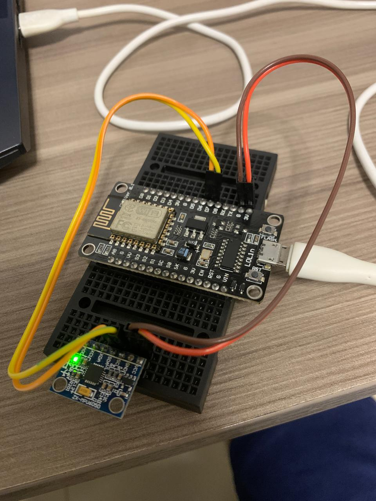
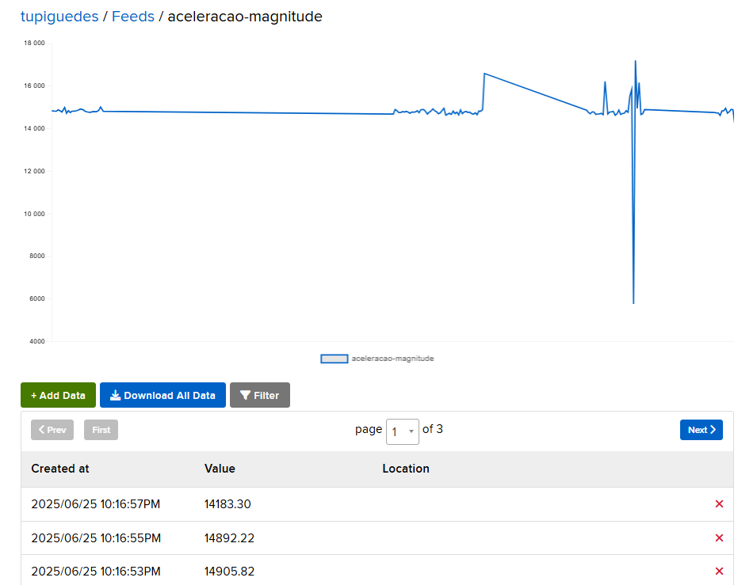
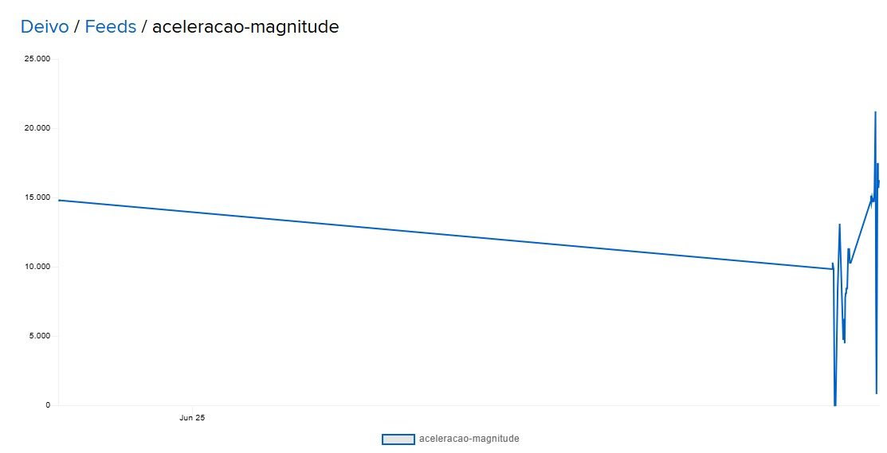
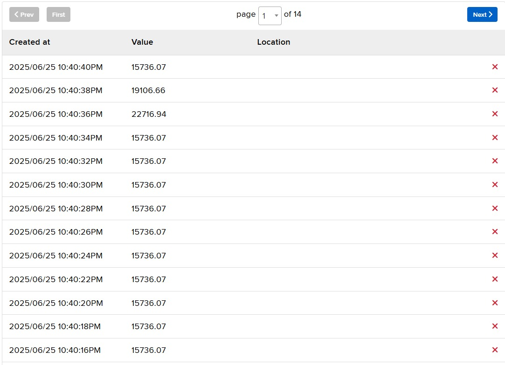

# Projeto de Segurança de Objeto com Sensor de Movimento (IoT)

<p align="center">
  
  
  
  
  
</p>

## 🚀 Visão Geral do Projeto

Este projeto demonstra uma solução de segurança baseada em IoT para monitoramento de objetos de grande valor. Utilizando um microcontrolador ESP8266 e um sensor de movimento MPU6050, o sistema detecta alterações na posição de um objeto e envia alertas em tempo real para um dashboard na plataforma Adafruit IO via protocolo MQTT. Ideal para museus, exposições ou monitoramento residencial de itens de valor.

## 👥 Colaboradores

* Beatriz Rabelo
* Deivide Maciel
* Tupi Guedes Ribas
* Everton Santana
* Robert Santos Santana
* Anderson Teixeira
* Giovanna Santos

## ✨ Funcionalidades

* Detecção de movimento em tempo real utilizando o acelerômetro MPU6050.
* Calibração dinâmica da linha de base do sensor para maior precisão.
* Publicação contínua de dados de magnitude de aceleração no Adafruit IO.
* Envio de alertas de status de movimento (movimento detectado/cessado) para o Adafruit IO.
* Conectividade Wi-Fi para comunicação com a nuvem.


## 🛠️ Hardware Necessário

* **ESP8266** (NodeMCU, ESP-01S ou similar)
* **Sensor MPU6050** (Acelerômetro e Giroscópio)
* Fios jumper
* Protoboard (opcional)

## 🔌 Esquema de Conexão (Wiring)

Conecte o sensor MPU6050 ao ESP8266 da seguinte forma:

| MPU6050 Pin | ESP8266 Pin (NodeMCU) | Descrição |
| :---------- | :-------------------- | :-------- |
| VCC         | 3 V                  | Alimentação |
| GND         | GND                   | Terra |
| SDA         | D6 (GPIO12)           | Data I2C |
| SCL         | D7 (GPIO13)           | Clock I2C |
| AD0         | GND (se não for usado) | Endereço I2C (0x68) |

### Onde e Por Que as Mudanças Foram Feitas:

1.  **Sessão `🔌 Montagem das Conexões`:**
    * **Imagem adicionada:** 

2.  **Sessão `📊 Dashboard e Resultados em Tempo Real`:**
    `🎥 Configuração e Detecção em Ação` para agrupar as saídas que mostram o projeto funcionando.
    * **`Saída do Terminal do ESP8266`:** Mantive a imagem existente, mas adicionei uma nota sobre o `limiar_desvio=300` ter sido utilizado neste exemplo, conectando a configuração de software com o resultado prático.
    * **`Status de Movimento (movimento-status)`:** Destacando a transição de `0` para `1` e vice-versa, 1 para movimento e 0 para a ausência do movimento.
        * **Imagem adicionada:** 
    * **`Magnitude da Aceleração (aceleracao-magnitude)`:**
        **Imagens adicionadas:**
            * 
            
    * **`Outros Exemplos de Magnitude da Aceleração (Usuário 'Deivo')`:**
        * **Imagem adicionada:** 


## ⚙️ Configuração do Software

### 1. Ambiente de Desenvolvimento

Certifique-se de ter o MicroPython instalado no seu ESP8266. Você pode usar `esptool.py` ou ferramentas como o `Thonny IDE` para flashar o firmware.

### 2. Gerenciamento de Credenciais (Segurança!)

**Para sua segurança, as chaves de API e credenciais de Wi-Fi NÃO devem ser expostas diretamente no `main.py` em repositórios públicos.**

Crie um arquivo chamado `secrets.py` (ou `config.py`) no mesmo diretório do seu `main.py` com o seguinte conteúdo:

```python
# secrets.py
WIFI_SSID = 'SEU_SSID_WIFI'
WIFI_PASSWORD = 'SUA_SENHA_WIFI'
ADAFRUIT_AIO_USERNAME = "SEU_USERNAME_ADAFRUIT_IO"
ADAFRUIT_AIO_KEY = "SUA_CHAVE_ADAFRUIT_IO" # Ex: aio_xxxxxxxxxxxxxxxxxxxxxx