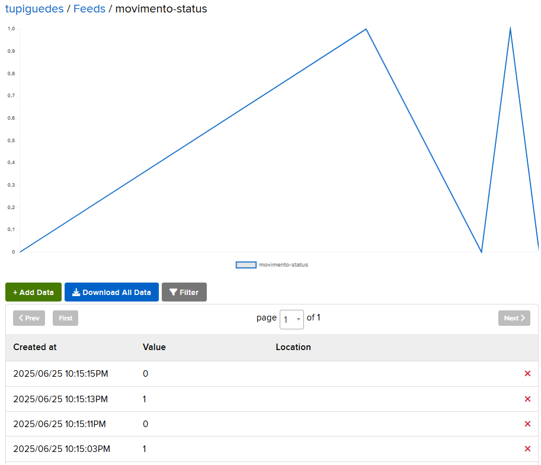

<h1>Projeto com Sensor de Movimento para Contramedida de Segurança usando IoT</h1>
<h3>Colaboradores do Projeto</h3>

Beatriz Rabelo, Deivide Maciel, Tupi Guedes
Vitor Emmanuel Andrade, Everton Santana, Robert Santos Santana, Anderson Teixeira e
Giovanna Santos

<h3>DashBoard</h3>

Caso tenha movimentação por parte do sensor, ele será registrado.

Desvio e Magnitude do Sensor

Saída do terminal

